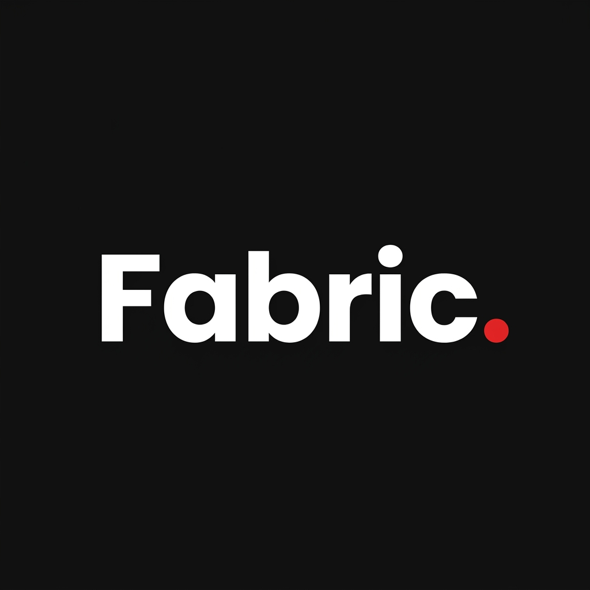

<div align="center">
  
  <br>
  <h1>🧬 Laravel Fabric</h1>
  <p><b>The High-Performance Orchestration Engine for the Modern Web.</b></p>
  
  [](https://clcbws.com)
  [](https://packagist.org/packages/clcbws/laravel-fabric)
  [](https://github.com/ahtesham-clcbws/laravel-fabric/stargazers)
  [](https://php.net)
  [](https://laravel.com)
  [](https://tailwindcss.com)
  [](LICENSE)
</div>

---

## 🌟 What is Fabric?

Fabric is a **Ghost Scaffolding Engine** designed for enterprise-grade productivity. Unlike traditional CRUD generators, Fabric forges **high-fidelity, themed UI ecosystems** that are 100% native and framework-agnostic. 

It follows the **"Forge and Depart"** philosophy: Fabric builds the code, injects the logic, and then steps away. You own the code; we just accelerate the creation.

---

## 🔥 The 25+ Killer Features (The Forge Suite)

Fabric replaces dozens of external dependencies with high-performance, forged implementations:

1.  🧶 **The Loom Engine**: Deep schema introspection & relationship mapping.
2.  🔨 **The Fabricator**: Master forge for Models, Controllers, and Livewire Views.
3.  🔦 **Global Spotlight**: Ctrl+K native command palette searching across your ecosystem.
4.  🕸️ **Nexus Graph**: Instant Mermaid.js visualization of your database architecture.
5.  🧠 **Neural AI-Context**: Generates architectural maps for perfect AI pair-programming.
6.  🛡️ **Shield ACL**: Unified RBAC visibility integrated directly into UI stubs.
7.  ⚗️ **The Alchemist**: Transmute static HTML designs into dynamic, smart Fabric stubs.
8.  🏥 **Lazarus Engine**: Surgically update existing components when DB schemas change.
9.  🎭 **Native Impersonation**: One-click administrative control with zero external overhead.
10. 🧹 **Asset Vacuum**: Deep-cleans orphaned assets and optimizes build sizes.
11. 🧼 **Data Anonymizer**: Irreversibly scrub PII for safe staging and development.
12. 🩺 **The Doctor**: Advanced diagnostic suite for environment health and parity.
13. 🧙 **The Wizard**: Interactive, step-by-step guidance for complex resource forging.
14. 🔄 **Reverse Migration**: Snapshot existing database tables into Laravel migrations.
15. 🚀 **Postman Forger**: Instant REST API collection generation for every model.
16. 🛰️ **Performance Sentry**: N+1 protection and lazy-loading guards for local dev.
17. 🌊 **Mass Hydrator**: High-fidelity data seeding and factory population.
18. 🔒 **System Jail**: Instant security lockdown mode for critical maintenance.
19. 📏 **Manifesto Lint**: Enforces "Universal Manifesto" standards across your codebase.
20. 🏁 **Ready Pre-flight**: Comprehensive deployment readiness and asset check.
21. 🎨 **Library Lexicon**: Terminal-first explorer for 500+ forgeable blocks.
22. 💎 **Smart Atomics**: Real-time flag-based generation (`--type`, `--size`, `--color`).
23. 🖥️ **Multi-Library Support**: Native integration for Preline, DaisyUI, Meraki, and more.
24. ⚡ **Headless API**: Instant resource and controller generation for slim APIs.
25. 🧬 **Shield Guard**: License-bound security and configuration drift protection.

---

## 🏗️ Design System Support

Fabric is the only engine that supports multiple design systems in a single project:

- **Preline UI**: The Enterprise standard.
- **DaisyUI**: The Mary UI-inspired semantic framework.
- **Meraki UI**: High-fidelity marketing blocks.
- **FloatUI**: Minimalist, clean SaaS aesthetics.
- **HyperUI**: Product-focused, high-contrast layouts.
- **Tailgrids**: Modern dashboard and SaaS blueprints.
- **Shadcn**: Atomic, utility-first components.

---

## 🛠️ Installation & Setup

### 1. Requirements
- **PHP**: 8.3 or higher
- **Laravel**: 13.0 or higher
- **Livewire**: 4.x
- **Tailwind CSS**: v4.0

### 2. Quick Install
```bash
composer require clcbws/laravel-fabric --dev
```

### 3. Initialize the Forge
```bash
php artisan fabric:install
php artisan fabric:doctor
```

### 4. Forge Your First Resource
```bash
php artisan fabric:generate User
```

---

## 📖 Documentation

Explore the full testament of the Fabric way at our live documentation site:
**[https://laravel-fabric.netlify.app/](https://laravel-fabric.netlify.app/)**

- **[Quick Start Guide](https://laravel-fabric.netlify.app/#/testaments/installation)**
- **[CLI Commands Reference](https://laravel-fabric.netlify.app/#/cli/commands)**
- **[Design System Lexicon](https://laravel-fabric.netlify.app/#/design-systems/overview)**
- **[The Loom Philosophy](https://laravel-fabric.netlify.app/#/the-fabric-way)**

---

## 📝 Commercial Licensing & Support

Laravel Fabric is **Proprietary Commercial Software** developed by Broadway Web Service. 

- **Email**: [support@clcbws.com](mailto:support@clcbws.com)
- **Web**: [clcbws.com](https://clcbws.com)

---

*Forged with ❤️ by CLCBWS.*
